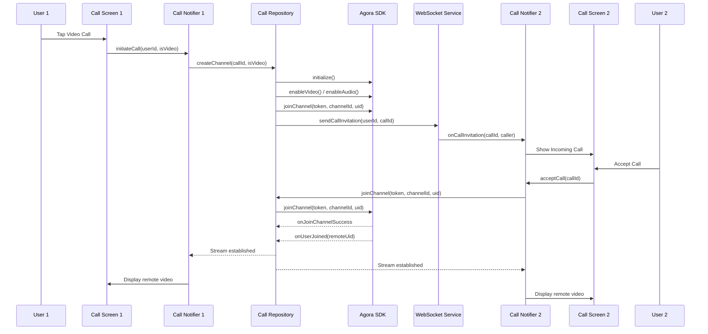

# Design Document: Agora Video and Audio Call Integration

## Overview

This document outlines the design for integrating Agora SDK into the Chattrix UI application to enable real-time video and audio calling capabilities. The implementation follows Clean Architecture principles with clear separation between Presentation, Domain, and Data layers. The design leverages Agora's Flutter SDK (agora_rtc_engine) for WebRTC-based communication while maintaining framework-agnostic domain logic.

The call system will support:
- One-to-one video calls with camera controls
- One-to-one audio calls
- Real-time media control (mute/unmute, camera on/off, camera switching)
- Call quality monitoring and indicators
- Secure token-based authentication
- Call history tracking
- Background call notifications

## Architecture

### Layer Overview

```
┌─────────────────────────────────────────────────────────────┐
│                    Presentation Layer                        │
│  ┌──────────────┐  ┌──────────────┐  ┌──────────────┐      │
│  │ Call Screen  │  │ Call Notifier│  │ Call Widgets │      │
│  │ (UI)         │  │ (Riverpod)   │  │              │      │
│  └──────────────┘  └──────────────┘  └──────────────┘      │
└─────────────────────────────────────────────────────────────┘
                           │
                           ▼
┌─────────────────────────────────────────────────────────────┐
│                      Domain Layer                            │
│  ┌──────────────┐  ┌──────────────┐  ┌──────────────┐      │
│  │ Call Entity  │  │ Call Repo    │  │ Use Cases    │      │
│  │              │  │ Interface    │  │              │      │
│  └──────────────┘  └──────────────┘  └──────────────┘      │
└─────────────────────────────────────────────────────────────┘
                           │
                           ▼
┌─────────────────────────────────────────────────────────────┐
│                       Data Layer                             │
│  ┌──────────────┐  ┌──────────────┐  ┌──────────────┐      │
│  │ Call Repo    │  │ Agora Service│  │ Call Model   │      │
│  │ Impl         │  │              │  │ (DTO)        │      │
│  └──────────────┘  └──────────────┘  └──────────────┘      │
└─────────────────────────────────────────────────────────────┘
                           │
                           ▼
                  ┌──────────────────┐
                  │   Agora SDK      │
                  │  (agora_rtc_eng) │
                  └──────────────────┘
```

### Call Flow Sequence



## Components and Interfaces

### Domain Layer

#### Call Entity
```dart
@freezed
class CallEntity with _$CallEntity {
  const factory CallEntity({
    required String callId,
    required String channelId,
    required String localUserId,
    required String remoteUserId,
    required CallType callType,
    required CallStatus status,
    required DateTime startTime,
    DateTime? endTime,
    required bool isLocalAudioMuted,
    required bool isLocalVideoMuted,
    required CameraFacing cameraFacing,
    NetworkQuality? networkQuality,
  }) = _CallEntity;
}

enum CallType { audio, video }

enum CallStatus {
  initiating,
  ringing,
  connecting,
  connected,
  disconnecting,
  ended,
  missed,
  rejected,
  failed
}

enum CameraFacing { front, rear }

enum NetworkQuality { excellent, good, poor, bad, veryBad, unknown }
```

#### Call Repository Interface
```dart
abstract class CallRepository {
  /// Initialize Agora RTC Engine
  Future<Either<Failure, void>> initialize();
  
  /// Create and join a new call channel
  Future<Either<Failure, CallEntity>> createCall({
    required String callId,
    required String channelId,
    required String remoteUserId,
    required CallType callType,
  });
  
  /// Join an existing call channel
  Future<Either<Failure, CallEntity>> joinCall({
    required String callId,
    required String channelId,
    required String remoteUserId,
    required CallType callType,
  });
  
  /// Leave the current call and cleanup resources
  Future<Either<Failure, void>> endCall(String callId);
  
  /// Toggle local audio mute state
  Future<Either<Failure, bool>> toggleAudioMute();
  
  /// Toggle local video enable state
  Future<Either<Failure, bool>> toggleVideo();
  
  /// Switch between front and rear camera
  Future<Either<Failure, CameraFacing>> switchCamera();
  
  /// Get current call state
  Stream<CallEntity> watchCallState(String callId);
  
  /// Get network quality updates
  Stream<NetworkQuality> watchNetworkQuality();
  
  /// Save call to history
  Future<Either<Failure, void>> saveCallHistory(CallEntity call);
  
  /// Get call history
  Future<Either<Failure, List<CallHistoryEntity>>> getCallHistory();
  
  /// Dispose resources
  Future<void> dispose();
}
```

#### Call History Entity
```dart
@freezed
class CallHistoryEntity with _$CallHistoryEntity {
  const factory CallHistoryEntity({
    required String id,
    required String remoteUserId,
    required String remoteUserName,
    required CallType callType,
    required CallStatus status,
    required DateTime timestamp,
    int? durationSeconds,
  }) = _CallHistoryEntity;
}
```

### Data Layer

#### Call Repository Implementation
```dart
class CallRepositoryImpl implements CallRepository {
  final AgoraService _agoraService;
  final CallLocalDataSource _localDataSource;
  final TokenService _tokenService;
  final WebSocketService _webSocketService;
  
  CallRepositoryImpl({
    required AgoraService agoraService,
    required CallLocalDataSource localDataSource,
    required TokenService tokenService,
    required WebSocketService webSocketService,
  }) : _agoraService = agoraService,
       _localDataSource = localDataSource,
       _tokenService = tokenService,
       _webSocketService = webSocketService;
  
  // Implementation details...
}
```

#### Agora Service
```dart
class AgoraService {
  late final RtcEngine _engine;
  final StreamController<CallEvent> _eventController;
  
  Future<void> initialize(String appId);
  Future<void> joinChannel({
    required String token,
    required String channelId,
    required int uid,
    required bool isVideo,
  });
  Future<void> leaveChannel();
  Future<void> muteLocalAudioStream(bool mute);
  Future<void> muteLocalVideoStream(bool mute);
  Future<void> switchCamera();
  Stream<CallEvent> get events;
  Future<void> dispose();
}
```

#### Call Model (DTO)
```dart
@freezed
class CallModel with _$CallModel {
  const factory CallModel({
    required String callId,
    required String channelId,
    required String localUserId,
    required String remoteUserId,
    required String callType,
    required String status,
    required String startTime,
    String? endTime,
    required bool isLocalAudioMuted,
    required bool isLocalVideoMuted,
    required String cameraFacing,
    String? networkQuality,
  }) = _CallModel;
  
  factory CallModel.fromJson(Map<String, dynamic> json) =>
      _$CallModelFromJson(json);
  
  factory CallModel.fromEntity(CallEntity entity);
}

extension CallModelX on CallModel {
  CallEntity toEntity() {
    // Conversion logic
  }
}
```

### Presentation Layer

#### Call Notifier
```dart
@riverpod
class CallNotifier extends _$CallNotifier {
  @override
  FutureOr<CallEntity?> build() async {
    return null;
  }
  
  Future<void> initiateCall({
    required String remoteUserId,
    required CallType callType,
  }) async {
    state = const AsyncValue.loading();
    
    final repository = ref.read(callRepositoryProvider);
    final result = await repository.createCall(
      callId: _generateCallId(),
      channelId: _generateChannelId(),
      remoteUserId: remoteUserId,
      callType: callType,
    );
    
    result.fold(
      (failure) => state = AsyncValue.error(failure, StackTrace.current),
      (call) => state = AsyncValue.data(call),
    );
  }
  
  Future<void> acceptCall(String callId, String channelId) async {
    // Implementation
  }
  
  Future<void> endCall() async {
    // Implementation
  }
  
  Future<void> toggleMute() async {
    // Implementation
  }
  
  Future<void> toggleVideo() async {
    // Implementation
  }
  
  Future<void> switchCamera() async {
    // Implementation
  }
}
```

#### Call Screen Widget
```dart
class CallScreen extends HookConsumerWidget {
  final String callId;
  final String remoteUserId;
  final CallType callType;
  
  @override
  Widget build(BuildContext context, WidgetRef ref) {
    final callState = ref.watch(callNotifierProvider);
    
    return callState.when(
      loading: () => const CallLoadingView(),
      error: (error, stack) => CallErrorView(error: error),
      data: (call) {
        if (call == null) return const SizedBox();
        
        return Scaffold(
          body: Stack(
            children: [
              // Remote video view
              if (call.callType == CallType.video)
                const RemoteVideoView(),
              
              // Local video preview
              if (call.callType == CallType.video)
                const Positioned(
                  top: 50,
                  right: 20,
                  child: LocalVideoPreview(),
                ),
              
              // Call controls
              Positioned(
                bottom: 50,
                left: 0,
                right: 0,
                child: CallControls(call: call),
              ),
              
              // Call info
              Positioned(
                top: 50,
                left: 20,
                child: CallInfo(call: call),
              ),
            ],
          ),
        );
      },
    );
  }
}
```

## Data Models

### Call State Management

The call state is managed through Riverpod's `AsyncNotifier` pattern, providing reactive updates to the UI:

```dart
// Current call state
@riverpod
class CallNotifier extends _$CallNotifier {
  @override
  FutureOr<CallEntity?> build() async => null;
}

// Network quality stream
@riverpod
Stream<NetworkQuality> networkQuality(NetworkQualityRef ref) {
  final repository = ref.watch(callRepositoryProvider);
  return repository.watchNetworkQuality();
}

// Call history
@riverpod
class CallHistory extends _$CallHistory {
  @override
  FutureOr<List<CallHistoryEntity>> build() async {
    final repository = ref.read(callRepositoryProvider);
    final result = await repository.getCallHistory();
    return result.fold(
      (failure) => throw failure,
      (history) => history,
    );
  }
}
```

### Local Storage Schema

Call history will be stored locally using the existing persistence mechanism:

```dart
// Table: call_history
{
  "id": "uuid",
  "remote_user_id": "string",
  "remote_user_name": "string",
  "call_type": "audio|video",
  "status": "completed|missed|rejected|failed",
  "timestamp": "iso8601",
  "duration_seconds": "int?"
}
```

### WebSocket Signaling Messages

Call invitations and signaling will use the existing WebSocket service:

```dart
// Outgoing: Call Invitation
{
  "type": "call_invitation",
  "call_id": "uuid",
  "channel_id": "string",
  "caller_id": "string",
  "caller_name": "string",
  "call_type": "audio|video",
  "timestamp": "iso8601"
}

// Incoming: Call Response
{
  "type": "call_response",
  "call_id": "uuid",
  "response": "accepted|rejected",
  "timestamp": "iso8601"
}

// Call End Notification
{
  "type": "call_ended",
  "call_id": "uuid",
  "ended_by": "string",
  "timestamp": "iso8601"
}
```

## Correctness Properties

*A property is a characteristic or behavior that should hold true across all valid executions of a system—essentially, a formal statement about what the system should do. Properties serve as the bridge between human-readable specifications and machine-verifiable correctness guarantees.*

### Property 1: Call initiation creates proper channel configuration
*For any* valid user-contact pair and call type, when initiating a call, the system should create a channel configuration with the correct call type and send an invitation message to the recipient.
**Validates: Requirements 1.1, 2.1**

### Property 2: Accepting call joins both participants to same channel
*For any* call invitation, when the recipient accepts, both the caller and recipient should be joined to the same Agora channel ID.
**Validates: Requirements 1.3**

### Property 3: Video call UI contains both local and remote streams
*For any* established video call, the UI state should contain references to both local video preview and remote video feed.
**Validates: Requirements 1.4**

### Property 4: Camera permission requested before video capture
*For any* video call initiation, the system should request camera permission before attempting to enable the camera.
**Validates: Requirements 1.5**

### Property 5: Microphone permission requested before audio capture
*For any* call initiation (audio or video), the system should request microphone permission before attempting to enable the microphone.
**Validates: Requirements 2.4**

### Property 6: Audio-only calls have video disabled
*For any* audio-only call, the video stream state should be disabled throughout the call duration.
**Validates: Requirements 2.2**

### Property 7: Muting microphone stops audio transmission
*For any* active call, when the user mutes the microphone, the local audio stream transmission state should change to muted.
**Validates: Requirements 3.3**

### Property 8: Disabling camera stops video transmission
*For any* active video call, when the user disables the camera, the local video stream transmission state should change to disabled.
**Validates: Requirements 3.4**

### Property 9: UI state reflects media control changes
*For any* media control toggle (mute/unmute, camera on/off), the UI state should immediately reflect the new media state.
**Validates: Requirements 3.5**

### Property 10: Camera switch toggles facing mode
*For any* active video call, when the user switches camera, the camera facing mode should toggle between front and rear.
**Validates: Requirements 4.2**

### Property 11: Stream remains connected during camera switch
*For any* camera switch operation, the video stream connection state should remain connected throughout the switch.
**Validates: Requirements 4.3**

### Property 12: Camera switch button visibility depends on available cameras
*For any* device, the camera switch button should be visible if and only if the device has multiple cameras.
**Validates: Requirements 4.4**

### Property 13: Ending call releases all resources
*For any* active call, when the call ends, the system should transition to disconnected state and release all media resources.
**Validates: Requirements 5.1, 5.2**

### Property 14: End call sends notification to remote participant
*For any* active call, when one participant ends the call, an end-call message should be sent to the other participant.
**Validates: Requirements 5.3**

### Property 15: Call duration is tracked and displayed
*For any* active call, the UI state should include the current call duration that increases over time.
**Validates: Requirements 6.1**

### Property 16: Network quality changes update UI indicators
*For any* network quality change event, the UI state should be updated to reflect the new quality level.
**Validates: Requirements 6.2**

### Property 17: Poor network quality triggers warning
*For any* call, when network quality drops to poor or worse, the UI state should include a warning indicator.
**Validates: Requirements 6.3**

### Property 18: Quality events trigger logging
*For any* packet loss or quality degradation event, the system should log the quality metrics.
**Validates: Requirements 6.4**

### Property 19: Channel join includes valid token
*For any* channel join operation, the request should include a valid Agora authentication token.
**Validates: Requirements 8.1**

### Property 20: Token expiration triggers refresh request
*For any* token expiration event during an active call, the system should request a new token from the backend.
**Validates: Requirements 8.2**

### Property 21: Token renewal failure disconnects call
*For any* token renewal failure, the system should disconnect the call and transition to an error state.
**Validates: Requirements 8.5**

### Property 22: Background invitations trigger notifications
*For any* call invitation received while the app is in background, the system should display a system notification.
**Validates: Requirements 9.1**

### Property 23: Notification tap navigates to call screen
*For any* call notification tap, the system should navigate to the incoming call screen.
**Validates: Requirements 9.2**

### Property 24: Expired invitations are cleaned up
*For any* call invitation that times out, the system should dismiss the notification and clean up the invitation state.
**Validates: Requirements 9.3**

### Property 25: Multiple invitations handled sequentially
*For any* sequence of multiple call invitations, the system should handle them without state conflicts.
**Validates: Requirements 9.5**

### Property 26: Participant information displayed in UI
*For any* active call, the UI state should include participant names and connection status.
**Validates: Requirements 10.4**

### Property 27: Orientation changes trigger layout updates
*For any* device orientation change during a call, the UI should update its layout appropriately.
**Validates: Requirements 10.5**

### Property 28: SDK initialization failure prevents call initiation
*For any* Agora SDK initialization failure, the system should transition to an error state and prevent call initiation.
**Validates: Requirements 11.1**

### Property 29: Channel join failure returns Failure type
*For any* failed channel join operation, the repository method should return a Failure object with a descriptive error message.
**Validates: Requirements 11.2**

### Property 30: Permission denial triggers appropriate UI
*For any* camera or microphone permission denial, the system should display a permission request dialog.
**Validates: Requirements 11.3**

### Property 31: Errors trigger logging
*For any* call error, the system should log the error details including error type and context.
**Validates: Requirements 11.5**

### Property 32: Completed calls saved with metadata
*For any* completed call, the system should save call metadata including duration, participants, and timestamp to local storage.
**Validates: Requirements 12.1**

### Property 33: Missed calls recorded in history
*For any* missed call (invitation timeout or rejection), the system should save it to call history with missed status.
**Validates: Requirements 12.2**

### Property 34: Call history sorted chronologically
*For any* call history query, the results should be sorted in reverse chronological order (newest first).
**Validates: Requirements 12.4**

### Property 35: History entry tap provides callback option
*For any* call history entry tap, the UI should provide an option to initiate a new call to that participant.
**Validates: Requirements 12.5**

## Error Handling

### Failure Types

```dart
@freezed
class Failure with _$Failure {
  const factory Failure.network(String message) = NetworkFailure;
  const factory Failure.permission(String message) = PermissionFailure;
  const factory Failure.agoraEngine(String message, int? code) = AgoraEngineFailure;
  const factory Failure.tokenExpired(String message) = TokenExpiredFailure;
  const factory Failure.channelJoin(String message) = ChannelJoinFailure;
  const factory Failure.unknown(String message) = UnknownFailure;
}
```

### Error Handling Strategy

1. **Repository Layer**: All operations return `Either<Failure, T>` to explicitly handle errors
2. **Presentation Layer**: Notifiers catch failures and update state with `AsyncValue.error`
3. **UI Layer**: Error states display user-friendly messages with retry options
4. **Logging**: All errors are logged with context for debugging

### Permission Handling

```dart
class PermissionService {
  Future<Either<Failure, bool>> requestCameraPermission();
  Future<Either<Failure, bool>> requestMicrophonePermission();
  Future<bool> checkCameraPermission();
  Future<bool> checkMicrophonePermission();
  Future<void> openAppSettings();
}
```

## Testing Strategy

### Unit Testing

Unit tests will verify specific examples and edge cases:

- **Repository Tests**: Mock Agora SDK and verify repository methods handle success/failure cases
- **Entity Tests**: Verify entity creation, validation, and transformations
- **Model Conversion Tests**: Test DTO to Entity conversions preserve data correctly
- **Permission Tests**: Verify permission request flows and error handling
- **Token Tests**: Test token refresh logic and expiration handling

### Property-Based Testing

Property-based tests will verify universal properties across all inputs using the **test** package with **faker** for data generation:

**Library**: Dart's built-in `test` package with custom property testing utilities
**Configuration**: Each property test should run a minimum of 100 iterations

Each property-based test MUST:
1. Be tagged with a comment referencing the design document property
2. Use the format: `// Feature: agora-video-audio-call, Property {number}: {property_text}`
3. Generate random valid inputs using faker or custom generators
4. Verify the property holds for all generated inputs

Example property test structure:
```dart
// Feature: agora-video-audio-call, Property 1: Call initiation creates proper channel configuration
test('call initiation creates proper channel configuration', () {
  for (int i = 0; i < 100; i++) {
    final userId = faker.guid.guid();
    final contactId = faker.guid.guid();
    final callType = faker.randomGenerator.boolean() ? CallType.video : CallType.audio;
    
    // Test that initiation creates correct configuration
    // and sends invitation
  }
});
```

### Integration Testing

Integration tests will verify:
- End-to-end call flows from initiation to completion
- WebSocket signaling integration
- Local storage persistence
- Permission flows on real devices

### Widget Testing

Widget tests will verify:
- Call screen renders correctly for different call states
- Control buttons respond to user interactions
- Error states display appropriate messages
- Loading states show progress indicators

## Dependencies

### Required Packages

```yaml
dependencies:
  # Agora SDK
  agora_rtc_engine: ^6.3.2
  
  # State Management
  hooks_riverpod: ^3.0.0
  flutter_hooks: ^0.20.0
  
  # Data Modeling
  freezed_annotation: ^2.4.1
  json_annotation: ^4.8.1
  
  # Functional Programming
  dartz: ^0.10.1
  
  # Permissions
  permission_handler: ^11.0.1
  
  # Environment
  flutter_dotenv: ^5.1.0
  
  # Existing dependencies
  dio: ^5.4.0
  web_socket_channel: ^2.4.0
  flutter_secure_storage: ^9.0.0
  go_router: ^13.0.0

dev_dependencies:
  # Code Generation
  build_runner: ^2.4.7
  freezed: ^2.4.6
  json_serializable: ^6.7.1
  riverpod_generator: ^3.0.0
  
  # Testing
  test: ^1.24.0
  faker: ^2.1.0
  mockito: ^5.4.4
```

### Environment Configuration

```env
# .env file
AGORA_APP_ID=your_agora_app_id_here
AGORA_TOKEN_SERVER_URL=https://your-backend.com/api/agora/token
```

## Implementation Notes

### Agora SDK Setup

1. **Initialize RTC Engine**: Create engine instance with App ID from environment
2. **Enable Audio/Video**: Configure audio and video modules based on call type
3. **Set Channel Profile**: Use `ChannelProfileCommunication` for 1-to-1 calls
4. **Join Channel**: Use token-based authentication for secure channel access
5. **Handle Callbacks**: Listen to engine events for connection state, remote users, quality updates

### Token Management

- Tokens should be generated by the backend server using Agora's token generation API
- Tokens have expiration time (typically 24 hours)
- Client requests new token before expiration or when receiving token expired callback
- Failed token renewal should gracefully end the call

### WebSocket Integration

- Reuse existing WebSocket service for call signaling
- Send call invitations through WebSocket
- Receive call responses and end notifications
- Handle connection state changes during calls

### Background Notifications

- Use `flutter_local_notifications` for displaying incoming call notifications
- Handle notification taps to navigate to call screen
- Dismiss notifications when call is answered or times out
- Integrate with existing notification system

### Performance Considerations

- Release camera and microphone resources immediately when call ends
- Dispose RTC engine when not in use
- Use hardware acceleration for video encoding/decoding
- Optimize video resolution based on network quality
- Implement adaptive bitrate for poor network conditions

### Platform-Specific Requirements

**Android**:
- Add permissions to AndroidManifest.xml: CAMERA, RECORD_AUDIO, INTERNET
- Handle runtime permissions using permission_handler
- Configure ProGuard rules for Agora SDK

**iOS**:
- Add usage descriptions to Info.plist: NSCameraUsageDescription, NSMicrophoneUsageDescription
- Configure background modes for VoIP if needed
- Handle interruptions (phone calls, alarms)

**Web**:
- Agora SDK supports web platform
- Request browser permissions for camera/microphone
- Handle browser-specific WebRTC limitations
