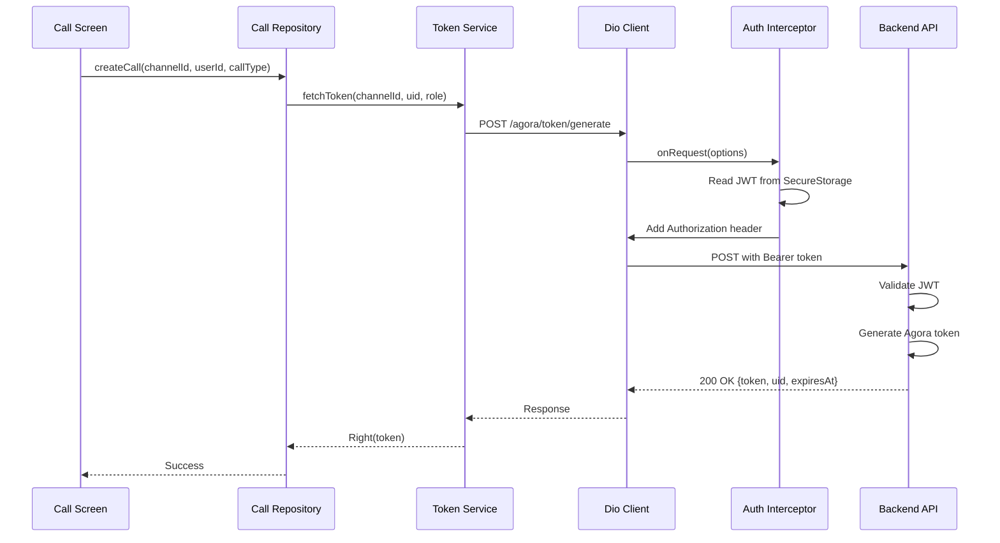

# Design Document - Fix Agora Token API Authentication

## Overview

This document outlines the design for fixing the authentication and endpoint issues when calling Agora token API from the Flutter application. The root cause analysis reveals that the `TokenService` is calling the wrong endpoint path, and there are opportunities to improve error handling and logging.

## Root Cause Analysis

### Issue 1: Incorrect Endpoint Path
**Current behavior:**
- `ApiConstants.agoraToken` returns: `http://localhost:8080/api/v1/agora/token/` (from .env)
- `TokenService.fetchToken()` calls: `POST http://localhost:8080/api/v1/agora/token/`
- Backend expects: `POST /api/v1/agora/token/generate`

**Result:** 404 Not Found or routing error

### Issue 2: Request Body Mismatch
**Current behavior:**
- TokenService sends: `{'channelName': channelId, 'uid': uid, 'role': role}`
- Backend expects: `{'channelId': channelId, 'role': role, 'expirationSeconds': 3600}`
- Backend auto-generates UID from authenticated user ID

**Result:** Validation error or incorrect data mapping

### Issue 3: Authentication Already Working
**Good news:**
- `AuthInterceptor` is already configured and working
- JWT token is automatically added to all requests
- Token refresh logic is implemented

**No changes needed** for authentication itself.

## Architecture

### Current Architecture (Simplified)

```
┌─────────────────────────────────────────────────────────────┐
│                    Presentation Layer                        │
│  ┌──────────────┐                                           │
│  │ Call Screen  │                                           │
│  └──────┬───────┘                                           │
└─────────┼─────────────────────────────────────────────────┘
          │
          ▼
┌─────────────────────────────────────────────────────────────┐
│                       Data Layer                             │
│  ┌──────────────┐  ┌──────────────┐  ┌──────────────┐      │
│  │ Call Repo    │  │ Token Service│  │ Agora Service│      │
│  │ Impl         │  │              │  │              │      │
│  └──────┬───────┘  └──────┬───────┘  └──────────────┘      │
└─────────┼──────────────────┼─────────────────────────────────┘
          │                  │
          │                  ▼
          │         ┌──────────────────┐
          │         │   Dio Client     │
          │         │  + Auth          │
          │         │    Interceptor   │
          │         └──────┬───────────┘
          │                │
          │                ▼
          │         ┌──────────────────┐
          │         │  Backend API     │
          │         │  /agora/token/   │
          │         │    generate      │
          │         └──────────────────┘
          │
          └────────► (Uses Token Service)
```

### Request Flow



## Components and Interfaces

### 1. API Constants (Updated)

**File:** `lib/core/constants/api_constants.dart`

**Changes:**
```dart
class ApiConstants {
  // ... existing code ...
  
  // Agora token endpoints - simple and straightforward
  static String get agoraTokenGenerate => '$_baseUrl/$_v1/agora/token/generate';
  
  static String get agoraTokenRefresh => '$_baseUrl/$_v1/agora/token/refresh';
}
```

**Remove the old `agoraToken` getter that reads from .env - không cần thiết!**

### 2. Token Service (Updated)

**File:** `lib/features/call/data/services/token_service.dart`

**Changes:**

```dart
class TokenService {
  final Dio _dio;
  final CallLogger? _logger;

  TokenService({
    required Dio dio,
    CallLogger? logger,
  })  : _dio = dio,
        _logger = logger;

  /// Fetches a new Agora token from the backend server
  ///
  /// The backend will:
  /// 1. Validate the JWT token from Authorization header
  /// 2. Extract user ID from the JWT
  /// 3. Generate a numeric UID from the user ID
  /// 4. Create an Agora token with the specified channel and role
  ///
  /// Parameters:
  /// - [channelId]: The Agora channel ID for which to generate the token
  /// - [role]: The role of the user ('publisher' or 'subscriber')
  /// - [expirationSeconds]: Token expiration time (default: 3600, max: 86400)
  ///
  /// Returns:
  /// - Right({token, uid, expiresAt}) on success
  /// - Left(Failure) on error
  Future<Either<Failure, Map<String, dynamic>>> fetchToken({
    required String channelId,
    String role = 'publisher',
    int expirationSeconds = 3600,
  }) async {
    _logger?.logInfo('Fetching Agora token for channel: $channelId, role: $role');
    
    try {
      // Validate inputs
      if (channelId.isEmpty) {
        return const Left(
          Failure.validation(
            message: 'Channel ID cannot be empty',
            errorCode: 'INVALID_CHANNEL_ID',
          ),
        );
      }
      
      if (!['publisher', 'subscriber'].contains(role)) {
        return const Left(
          Failure.validation(
            message: 'Role must be either "publisher" or "subscriber"',
            errorCode: 'INVALID_ROLE',
          ),
        );
      }
      
      if (expirationSeconds < 60 || expirationSeconds > 86400) {
        return const Left(
          Failure.validation(
            message: 'Expiration must be between 60 and 86400 seconds',
            errorCode: 'INVALID_EXPIRATION',
          ),
        );
      }

      _logger?.logDebug('Sending request to: ${ApiConstants.agoraTokenGenerate}');
      
      final response = await _dio.post(
        ApiConstants.agoraTokenGenerate,
        data: {
          'channelId': channelId,
          'role': role,
          'expirationSeconds': expirationSeconds,
        },
      );

      _logger?.logDebug('Response status: ${response.statusCode}');
      _logger?.logDebug('Response data: ${response.data}');

      if (response.statusCode == 200 || response.statusCode == 201) {
        final data = response.data['data'];
        
        if (data == null) {
          return const Left(
            Failure.server(
              message: 'Invalid response format from server',
              errorCode: 'INVALID_RESPONSE_FORMAT',
            ),
          );
        }

        final token = data['token'] as String?;
        final uid = data['uid'] as int?;
        final expiresAt = data['expiresAt'] as String?;

        if (token == null || token.isEmpty) {
          return const Left(
            Failure.server(
              message: 'Token is missing in response',
              errorCode: 'MISSING_TOKEN',
            ),
          );
        }
        
        if (uid == null) {
          return const Left(
            Failure.server(
              message: 'UID is missing in response',
              errorCode: 'MISSING_UID',
            ),
          );
        }

        _logger?.logInfo('Token fetched successfully. UID: $uid, Expires: $expiresAt');

        return Right({
          'token': token,
          'uid': uid,
          'channelId': channelId,
          'expiresAt': expiresAt,
        });
      } else {
        final message = response.data['error']?['message'] ?? 'Failed to fetch token';
        final errorCode = response.data['error']?['code'] ?? 'TOKEN_FETCH_FAILED';
        
        _logger?.logError('Token fetch failed: $message (Code: $errorCode)');
        
        return Left(
          Failure.server(
            message: message,
            errorCode: errorCode,
          ),
        );
      }
    } on DioException catch (e) {
      _logger?.logError('DioException while fetching token: ${e.message}');
      _logger?.logError('Response: ${e.response?.data}');
      return Left(_handleDioError(e));
    } catch (e, stackTrace) {
      _logger?.logError('Unexpected error while fetching token: $e');
      _logger?.logError('Stack trace: $stackTrace');
      return Left(
        Failure.unknown(
          message: 'Unexpected error while fetching token: ${e.toString()}',
        ),
      );
    }
  }

  /// Refreshes an existing Agora token
  ///
  /// Parameters:
  /// - [channelId]: The Agora channel ID
  /// - [oldToken]: The old token (for backend validation)
  ///
  /// Returns:
  /// - Right({token, uid, expiresAt}) on success
  /// - Left(Failure) on error
  Future<Either<Failure, Map<String, dynamic>>> refreshToken({
    required String channelId,
    required String oldToken,
  }) async {
    _logger?.logInfo('Refreshing Agora token for channel: $channelId');
    
    try {
      final response = await _dio.post(
        ApiConstants.agoraTokenRefresh,
        data: {
          'channelId': channelId,
          'oldToken': oldToken,
        },
      );

      if (response.statusCode == 200) {
        final data = response.data['data'];
        final token = data['token'] as String?;
        final uid = data['uid'] as int?;
        final expiresAt = data['expiresAt'] as String?;

        if (token == null || uid == null) {
          return const Left(
            Failure.server(
              message: 'Invalid token refresh response',
              errorCode: 'INVALID_REFRESH_RESPONSE',
            ),
          );
        }

        _logger?.logInfo('Token refreshed successfully');

        return Right({
          'token': token,
          'uid': uid,
          'channelId': channelId,
          'expiresAt': expiresAt,
        });
      } else {
        return Left(
          Failure.server(
            message: response.data['error']?['message'] ?? 'Failed to refresh token',
            errorCode: response.data['error']?['code'] ?? 'TOKEN_REFRESH_FAILED',
          ),
        );
      }
    } on DioException catch (e) {
      _logger?.logError('DioException while refreshing token: ${e.message}');
      return Left(_handleDioError(e));
    } catch (e) {
      _logger?.logError('Unexpected error while refreshing token: $e');
      return Left(
        Failure.unknown(
          message: 'Unexpected error while refreshing token: ${e.toString()}',
        ),
      );
    }
  }

  /// Converts Dio errors to appropriate Failure types
  Failure _handleDioError(DioException error) {
    switch (error.type) {
      case DioExceptionType.connectionTimeout:
      case DioExceptionType.sendTimeout:
      case DioExceptionType.receiveTimeout:
        return const Failure.network(
          message: 'Connection timeout. Please check your internet connection.',
        );

      case DioExceptionType.badResponse:
        final statusCode = error.response?.statusCode;
        final errorData = error.response?.data;
        final message = errorData?['error']?['message'] ?? 
                       errorData?['message'] ?? 
                       'Request failed';
        final errorCode = errorData?['error']?['code'] ?? 
                         errorData?['errorCode'];

        _logger?.logError('Bad response: Status $statusCode, Message: $message');

        if (statusCode == 401) {
          return Failure.unauthorized(
            message: 'Authentication failed. Please login again.',
            errorCode: errorCode,
          );
        } else if (statusCode == 403) {
          return Failure.forbidden(
            message: 'Access denied. You do not have permission to perform this action.',
            errorCode: errorCode,
          );
        } else if (statusCode == 404) {
          return Failure.notFound(
            message: 'Endpoint not found. Please check if the backend is running correctly.',
            errorCode: errorCode,
          );
        } else if (statusCode == 400) {
          return Failure.validation(
            message: message,
            errorCode: errorCode,
          );
        } else if (statusCode != null && statusCode >= 500) {
          return Failure.server(
            message: 'Server error. Please try again later.',
            errorCode: errorCode,
          );
        } else {
          return Failure.server(
            message: message,
            errorCode: errorCode,
          );
        }

      case DioExceptionType.cancel:
        return const Failure.unknown(
          message: 'Request was cancelled',
        );

      case DioExceptionType.connectionError:
        return Failure.network(
          message: 'Cannot connect to server. Please check if the backend is running at ${error.requestOptions.baseUrl}',
        );

      case DioExceptionType.unknown:
      default:
        final message = error.message ?? 'Unknown network error';
        return Failure.network(
          message: 'Network error: $message',
        );
    }
  }
}
```

### 3. Call Repository (Updated)

**File:** `lib/features/call/data/repositories/call_repository_impl.dart`

**Changes needed:**
- Update calls to `TokenService.fetchToken()` to handle new response format
- Extract `uid` from token response instead of generating it locally
- Pass token data to Agora service

**Example:**
```dart
@override
Future<Either<Failure, CallEntity>> createCall({
  required String callId,
  required String channelId,
  required String remoteUserId,
  required CallType callType,
}) async {
  try {
    // Fetch token from backend
    final tokenResult = await _tokenService.fetchToken(
      channelId: channelId,
      role: 'publisher',
    );

    return tokenResult.fold(
      (failure) => Left(failure),
      (tokenData) async {
        final token = tokenData['token'] as String;
        final uid = tokenData['uid'] as int;
        
        // Initialize Agora with token
        final initResult = await _agoraService.initialize(
          appId: _appId,
        );
        
        return initResult.fold(
          (failure) => Left(failure),
          (_) async {
            // Join channel with token
            final joinResult = await _agoraService.joinChannel(
              token: token,
              channelId: channelId,
              uid: uid,
              isVideo: callType == CallType.video,
            );
            
            // ... rest of implementation
          },
        );
      },
    );
  } catch (e) {
    return Left(Failure.unknown(message: e.toString()));
  }
}
```

### 4. Failure Types (Verify/Add)

**File:** `lib/core/errors/failures.dart`

**Ensure these failure types exist:**
```dart
@freezed
class Failure with _$Failure {
  const factory Failure.network({required String message}) = NetworkFailure;
  const factory Failure.server({required String message, String? errorCode}) = ServerFailure;
  const factory Failure.unauthorized({required String message, String? errorCode}) = UnauthorizedFailure;
  const factory Failure.forbidden({required String message, String? errorCode}) = ForbiddenFailure;
  const factory Failure.notFound({required String message, String? errorCode}) = NotFoundFailure;
  const factory Failure.validation({required String message, String? errorCode}) = ValidationFailure;
  const factory Failure.tokenExpired({required String message}) = TokenExpiredFailure;
  const factory Failure.unknown({required String message}) = UnknownFailure;
}
```

### 5. Environment Configuration

**File:** `.env`

**Keep it simple - chỉ cần AGORA_APP_ID:**
```env
# Agora Configuration
AGORA_APP_ID=9300ff3fc592405fa28e43a96ab2bf0f
```

**Remove `AGORA_TOKEN_SERVER_URL` - không cần thiết vì đã có baseUrl + version trong ApiConstants!**

### 6. Call Logger (Enhanced)

**File:** `lib/features/call/data/services/call_logger.dart`

**Add methods if not present:**
```dart
class CallLogger {
  void logInfo(String message) {
    print('[CALL_INFO] $message');
  }
  
  void logDebug(String message) {
    print('[CALL_DEBUG] $message');
  }
  
  void logError(String message) {
    print('[CALL_ERROR] $message');
  }
  
  void logWarning(String message) {
    print('[CALL_WARNING] $message');
  }
}
```

## Data Models

### Token Response Model

```dart
@freezed
class AgoraTokenResponse with _$AgoraTokenResponse {
  const factory AgoraTokenResponse({
    required String token,
    required int uid,
    required String channelId,
    required String expiresAt,
  }) = _AgoraTokenResponse;
  
  factory AgoraTokenResponse.fromJson(Map<String, dynamic> json) =>
      _$AgoraTokenResponseFromJson(json);
}
```

## Error Handling Strategy

### Error Flow

```
DioException
    │
    ├─► ConnectionTimeout ──► Failure.network("Connection timeout...")
    │
    ├─► BadResponse
    │       │
    │       ├─► 401 ──► Failure.unauthorized("Authentication failed...")
    │       ├─► 403 ──► Failure.forbidden("Access denied...")
    │       ├─► 404 ──► Failure.notFound("Endpoint not found...")
    │       ├─► 400 ──► Failure.validation(message from backend)
    │       └─► 5xx ──► Failure.server("Server error...")
    │
    ├─► ConnectionError ──► Failure.network("Cannot connect to server...")
    │
    └─► Unknown ──► Failure.network("Network error...")
```

### User-Friendly Error Messages

| Error Type | User Message | Action |
|------------|--------------|--------|
| 401 Unauthorized | "Authentication failed. Please login again." | Redirect to login |
| 403 Forbidden | "Access denied. You do not have permission." | Show error dialog |
| 404 Not Found | "Service unavailable. Please check if backend is running." | Show error dialog |
| 400 Validation | Show specific validation error from backend | Show error dialog |
| 500 Server Error | "Server error. Please try again later." | Show retry option |
| Connection Timeout | "Connection timeout. Please check your internet." | Show retry option |
| Connection Error | "Cannot connect to server at [URL]" | Show backend status |

## Testing Strategy

### Unit Tests

1. **TokenService Tests**
   - Test successful token fetch
   - Test token refresh
   - Test error handling for each DioException type
   - Test validation of input parameters
   - Test response parsing

2. **ApiConstants Tests**
   - Test endpoint URL generation
   - Test with/without trailing slash in env variable
   - Test fallback to default URL

3. **Error Handling Tests**
   - Test each Failure type is created correctly
   - Test error messages are user-friendly

### Integration Tests

1. **End-to-End Token Flow**
   - Test complete flow from UI to backend
   - Verify JWT token is sent in headers
   - Verify Agora token is received and used

2. **Authentication Flow**
   - Test with valid JWT token
   - Test with expired JWT token (should auto-refresh)
   - Test with invalid JWT token (should redirect to login)

### Manual Testing Checklist

- [ ] Backend is running on localhost:8080
- [ ] User is logged in (JWT token exists in secure storage)
- [ ] Call initiation triggers token fetch
- [ ] Token fetch succeeds and returns valid data
- [ ] Agora SDK can join channel with fetched token
- [ ] Error messages are clear and actionable
- [ ] Logs show request/response details

## Implementation Notes

### Priority 1: Fix Endpoint Path
1. Update `ApiConstants` to add `agoraTokenGenerate` and `agoraTokenRefresh` 
2. Remove old `agoraToken` getter that reads from .env
3. Test endpoint connectivity

### Priority 2: Fix Request/Response Format
1. Update `TokenService.fetchToken()` to send correct request body
2. Update response parsing to extract `uid` from backend
3. Update `CallRepository` to use `uid` from token response

### Priority 3: Enhance Error Handling
1. Add comprehensive error logging
2. Improve error messages for users
3. Add validation for input parameters

### Priority 4: Testing
1. Add unit tests for TokenService
2. Add integration tests for token flow
3. Manual testing with backend

## Deployment Considerations

### Environment Variables

**Đơn giản - chỉ cần AGORA_APP_ID:**
```env
AGORA_APP_ID=9300ff3fc592405fa28e43a96ab2bf0f
```

**Không cần AGORA_TOKEN_SERVER_URL** - endpoint được build từ `_baseUrl + _v1 + /agora/token/generate`

### Backend Requirements

1. Ensure `/api/v1/agora/token/generate` endpoint is deployed
2. Ensure `/api/v1/agora/token/refresh` endpoint is deployed
3. Verify CORS is configured for Flutter app origin
4. Verify JWT authentication is working

### Monitoring

1. Log all token fetch requests
2. Monitor token fetch success/failure rates
3. Alert on high failure rates
4. Track token expiration and refresh patterns
